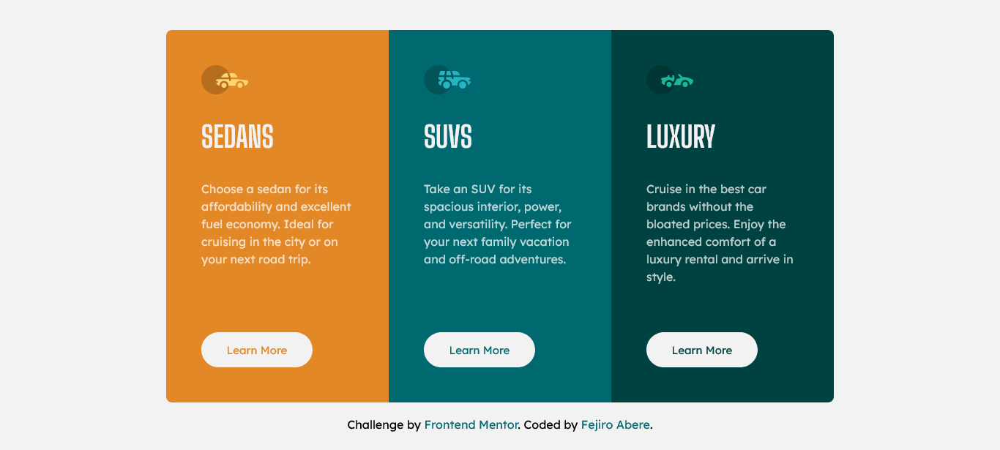

# Frontend Mentor - 3-column preview card component solution

This is a solution to the [3-column preview card component challenge on Frontend Mentor](https://www.frontendmentor.io/challenges/3column-preview-card-component-pH92eAR2-).

## Table of contents

- [Overview](#overview)
  - [The challenge](#the-challenge)
  - [Screenshot](#screenshot)
  - [Links](#links)
- [My process](#my-process)
  - [Built with](#built-with)
  - [What I learned](#what-i-learned)
  - [Continued development](#continued-development)
  - [Useful resources](#useful-resources)
- [Author](#author)

## Overview

### The challenge

Users should be able to:

- View the optimal layout depending on their device's screen size
- See hover states for interactive elements

### Screenshot

The 3 column preview card component


Hovering over a button


### Links

- Solution URL: [](https://your-solution-url.com)
- Live Site URL: [Live Site](https://fejiro001.github.io/3-column-preview-card-component-main/)

## My process

### Built with

- Semantic HTML5 markup
- Sass
- Flexbox
- CSS Grid
- Mobile-first workflow

### What I learned

Made use of the nth-child pseudo class 

```css
&:nth-child(1) {
  background-color: $bright-orange;
  border-radius: $cardRadius $cardRadius 0 0;

  @media (min-width: 50em) {
    border-radius: $cardRadius 0 0 $cardRadius;
  }

  button {
    @include buttons($bright-orange);
  }
}
```

### Continued development

I am doing well when it comes to responsive design and accessibility, so I would continue learning these topics.

### Useful resources

- [HTML/CSS Button Hover shifting everything else away?](https://stackoverflow.com/questions/60308488/html-css-button-hover-shifting-everything-else-away) - This helped me for fixing when my button on hover was increased the height of my section.

## Author

- Frontend Mentor - [@Fejiro001 ](https://www.frontendmentor.io/profile/Fejiro001)
- Twitter - [@aberefejiro ](https://www.twitter.com/aberefejiro)
